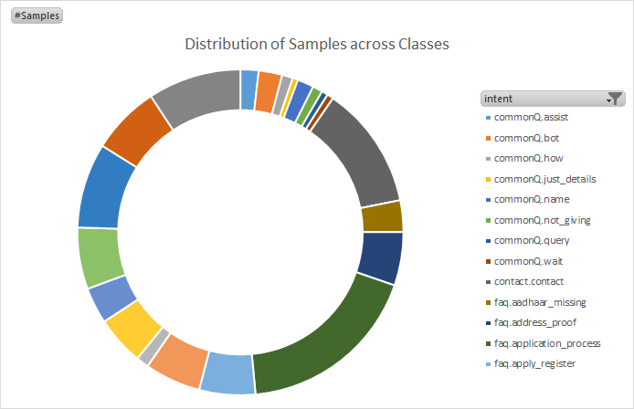

# Intent Classification with Pre-Trained vectors #

This is an experiment to see if Pre-Trained vectors improve validation accuracy for Chatbot intent classification tasks.  Experiment uses following article a a starting point.  Approach in the article achieves 87% validation accuracy.

https://towardsdatascience.com/a-brief-introduction-to-intent-classification-96fda6b1f557

Experiment achieves 96% validation accuracy  

Experiment includes :

 1. No processing/simplification for Words. This is done so that more linguistic information is visible to model
	 1. Case is retained for Words
	 2. No lemmatization 
 2.  300 Dimension Word Vectors (Instead of 128)
 3. Different network  design
	 - GRU Instead of LSTM 
	 - Deeper network with BatchNormalization
4. Glove pre-trained word vectors
	- Fasttext pre-trained vectors with sub-word  https://fasttext.cc/docs/en/english-vectors.html [2 million word vectors trained on Common Crawl (600B tokens).]
	- File : https://dl.fbaipublicfiles.com/fasttext/vectors-english/crawl-300d-2M.vec.zip
	- Since text corpus for vectors is Common Crawl  ( http://commoncrawl.org/ ), it solves some usual issues for Chatbot systems, such as
	  - mis-spelled words  
	  - Mixed Languages 
	    
## Dataset ##

Source of the dataset is not clear. It seems to be from a customer facing Chatbot.  Location of the data is : https://github.com/Dark-Sied/Intent_Classification/blob/master/Dataset.csv

TODO : Since distribution of samples across classes is not balanced, additional metrics such as AUC should be used for measurement of model's performance.

 

	     
